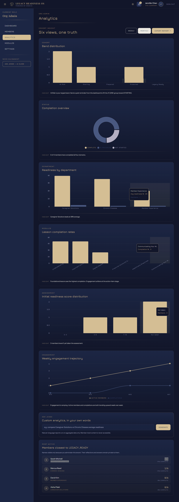

# Legacy Readiness OS — Endevo SaaS Prototype

<p align="center">
  
</p>

A privacy-first, B2B SaaS prototype for **Legacy Readiness OS** (LRos) — an employee benefit that helps members get their legal, financial, digital, and physical legacy in order. Built for the Cigna HR demo and other enterprise pitches.

This is a **UI demo only**: all data is mock; no backend, no real auth, no PII storage. The whole app runs in the browser from `src/lib/mock-data.ts`.

---

## At a glance

| Role | Login persona | Lives at | What they see |
|---|---|---|---|
| **Org Admin** (HR) | `jennifer.chen@xyzcompany.com` | [/org/admin/dashboard](src/app/org/admin/dashboard/page.tsx) | Aggregate workforce readiness · 0 individual answers |
| **Org Member** | `sarah.mitchell@xyzcompany.com` | [/org/member/dashboard](src/app/org/member/dashboard/page.tsx) | Personal Legacy Path · domains, lessons, reflections |
| **Super Admin** (Endevo) | `admin@endevo.com` | [/superadmin/dashboard](src/app/superadmin/dashboard/page.tsx) | Tenants, audit logs, platform health |

All login is mock — click any persona card on the landing page.

---

## Quick start

```bash
npm install
npm run dev
```

Open http://localhost:3000.

**Stack:** Next.js 16 (App Router) · TypeScript · Tailwind CSS 4 · Recharts · React Context for mock auth.

---

## Screenshots & visual reference

### Org Admin · Analytics — "How is this benefit doing?"

The flagship view for the Cigna demo. Six charts that move from headline outcome → deep operator detail.



**Source:** [src/app/org/admin/analytics/page.tsx](src/app/org/admin/analytics/page.tsx)

#### Charts on this page

| # | Section | Chart type | What it shows |
|---|---|---|---|
| 1 | **Outcome cards** | 3 stat tiles | `141 of 375` protected · `74%` started · `142` documents self-attested |
| 2 | **This week at a glance** | Narrative ribbon | `+23 new starts` · Finance crossed 50% · 4 wills attested · Q3 trajectory |
| 3 | **Cohort completion** | Donut (recharts `PieChart`) | Complete / In progress / Not started across 375 members |
| 4 | **Engagement by department** | Grouped bar (recharts `BarChart`) | Per-dept Completed action plan + Started assessment + Total members; tooltip per dept |
| 5 | **Action items completed** | Big-number card | `1,847` completed across 142 members · Avg 13/member · This week +18 · This month +72 |
| 6 | **LMS lessons across 6 topics** | Horizontal bars | Project Plan / Legal / Financial / Digital / Physical / Communication — `1,257` total |
| 7 | **Avg readiness — by department, per domain** | 4-color grouped bar | Sales: Legal 41% · Financial 47% · Digital 30% · Physical 28% (and so on per dept) |
| 8 | **Weekly engagement trajectory** | Line chart | Active members + Completions, W14 → W17 (`+195%` growth) |
| 9 | **Where do members fall off?** | Custom funnel | Invited → Started → Completed → Action Plan → Final Playbook; biggest drop highlighted in red |
| 10 | **Pick a template** | Report cards | Cohort summary · Department breakdown · At-risk members · Artifacts · Board report · Compliance bundle |
| 11 | **Members closest to LEGACY_READY** | Ranked list | Sarah / Marcus / David / Aisha — domain-completion progress |

#### Other visuals on the Org Admin side

| Page | File | Visuals |
|---|---|---|
| Cohort Readiness (dashboard) | [src/app/org/admin/dashboard/page.tsx](src/app/org/admin/dashboard/page.tsx) | Enrolled hero card · 4-week area chart (Avg readiness % + Lessons completed) · Domain engagement bars · Action cards |
| Members | [src/app/org/admin/employees/page.tsx](src/app/org/admin/employees/page.tsx) | Roster table with band pills · single + **Bulk invite (CSV)** with validation modal |
| Modules | [src/app/org/admin/modules/page.tsx](src/app/org/admin/modules/page.tsx) | Module catalog with completion bars |

#### Brand assets

<p>
  
  &nbsp;&nbsp;
  
</p>

- `public/asset/lros_logo_round.png` — square avatar mark
- `public/asset/lros_logo_name.png` — horizontal wordmark
- `public/asset/logo-complete-xlarge.png` — Endevo parent brand
- `public/asset/jesse-image.png` — trusted advisor avatar
- `public/asset/SVG-01.svg`, `SVG-02.svg` — icon set

---

## Routes & file map

```
src/app/
├── page.tsx                       # Persona-picker landing page
├── superadmin/
│   ├── dashboard/                 # Tenant rollup
│   ├── organizations/             # Per-tenant detail
│   ├── users/                     # Cross-tenant user search
│   ├── analytics/                 # Platform-wide trends
│   ├── audit-logs/                # Compliance event log
│   └── settings/
├── org/
│   ├── admin/
│   │   ├── dashboard/             # Cohort Readiness home
│   │   ├── analytics/             # ← The 6-chart executive view
│   │   ├── employees/             # Roster + bulk CSV invite
│   │   ├── modules/
│   │   └── settings/
│   └── member/
│       ├── dashboard/             # Member home + Trusted Advisor chat
│       ├── assessment/            # Domain picker (legal/financial/digital/physical)
│       ├── path/                  # Personal Legacy Path
│       ├── modules/[moduleId]/    # Lesson detail + reflection prompts
│       ├── certificates/
│       └── profile/
└── api/                           # Stub routes (mock)
```

---

## Cigna HR demo flow (suggested)

1. **Land** on persona picker → click **Jennifer Chen (Org Admin)**.
2. **Cohort Readiness dashboard** — show the privacy banner (*"You see only aggregate metrics"*) and the enrolled hero card (`278 of 375`).
3. Click **"Open analytics →"**.
4. Walk down the analytics page top-to-bottom:
   - 3 outcome cards → "141 of 375 are protected — that's the headline outcome."
   - **Funnel** → "Biggest drop is Action Plan → Final Playbook. That's where to invest a nudge."
   - **Engagement by department** → "Sales is at 51% started — needs a tap on the shoulder."
   - **Avg readiness per department per domain** → "HR leads on Physical readiness. Operations needs Financial focus."
   - **Weekly engagement trajectory** → "Active members up 195% in 4 weeks."
5. Open **Members** → demo the **Bulk invite (CSV)** flow with the template download.
6. Hop to **Sarah Mitchell** (member view) to show what the workforce experiences — Legacy Path, domains, lessons, Trusted Advisor chat.

---

## What's intentionally not built (yet)

- Real backend / database / API
- Real auth (NextAuth, Clerk, etc.)
- Document storage (and we never plan to — members self-attest, we never see the documents)
- Email delivery (invites are mocked with toasts)
- Bulk-invite production hardening: MX-record verification, malware scanning, paste-emails-as-text fallback

---

## Privacy posture (the demo's whole point)

Org Admins see **aggregate-only** metrics. They never see:
- Individual answers to assessments
- Reflection notes
- The actual will / directive / vault content

Members **self-attest** that documents exist. The number `142 documents in place` means 142 members ticked a box — no file upload, no scan, no inspection. This is reflected in copy across the analytics page (look for *"never uploaded, only confirmed"*).

---

## Reference docs

In `/docs`:
- `ENDevo_MVP_Specification.md` — product spec
- `DEMO_TRANSCRIPT.md` — sample demo script
- `ARCHITECTURE_IMPROVEMENTS.md` — backend transition plan
- `DEPLOYMENT_CHECKLIST.md`, `CICD_SETUP.md` — ops
- `ENDevo_Financial_Projections_2026.docx`, `ENDevo_Complete_Architecture_Project_Plan.xlsx`

---

## Deploy

Live demo deploys via Vercel: see `next.config.ts` and the screencap path (`endevo-saas-prototype-ui-ux.vercel.app`) for the convention.
